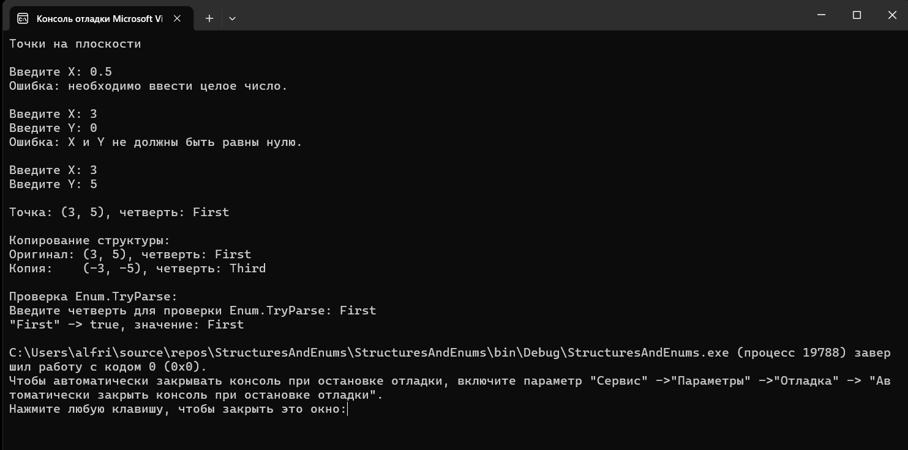
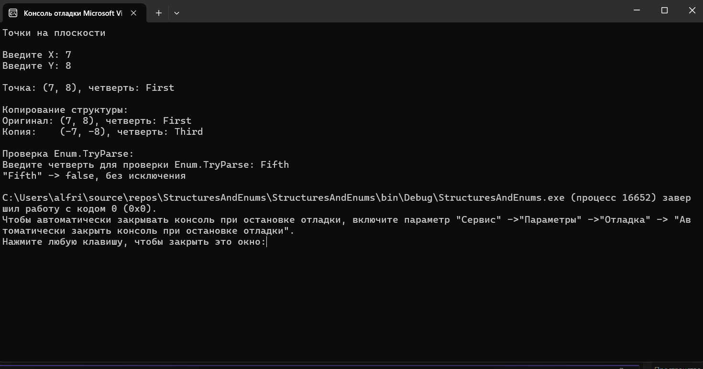

# StructuresAndEnums
## Задание «Контрольная точка №12 — структуры и перечисления»
# Вариант 1. Точка на плоскости
1. enum Quadrant { First, Second, Third, Fourth } — четверть координатной плоскости.
2. struct Point2D { int X; int Y; } — с методом, который вычисляет и возвращает Quadrant по знакам X и Y (для простоты считайте, что X и Y не равны нулю).
3. Переопределите ToString(), чтобы вывести координаты и номер четверти.
4. Продемонстрируйте копирование: создайте точку, скопируйте в другую переменную, измените координаты копии и выведите обе — убедитесь, что оригинал не изменился.
5. Продемонстрируйте Enum.TryParse<Quadrant> на строке, введённой как константа в коде (и на корректном, и на некорректном значении).

## Результаты и проверочные ключи
| Действие | Ожидаемый результат |
|---|---|
| `new Point2D { X = 3, Y = 5 }` → четверть | `First` |
| `new Point2D { X = -3, Y = 5 }` → четверть | `Second` |
| Копия точки, изменение копии | Оригинал не меняется |
| `Enum.TryParse<Quadrant>("First", out var q)` | `true`, `q == Quadrant.First` |
| `Enum.TryParse<Quadrant>("Fifth", out var q)` | `false`, без исключения |

# Итоговый результат 

